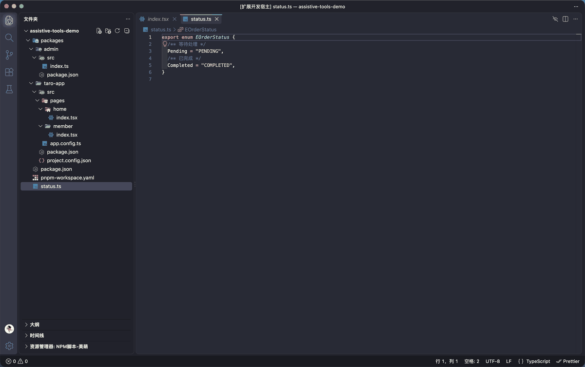
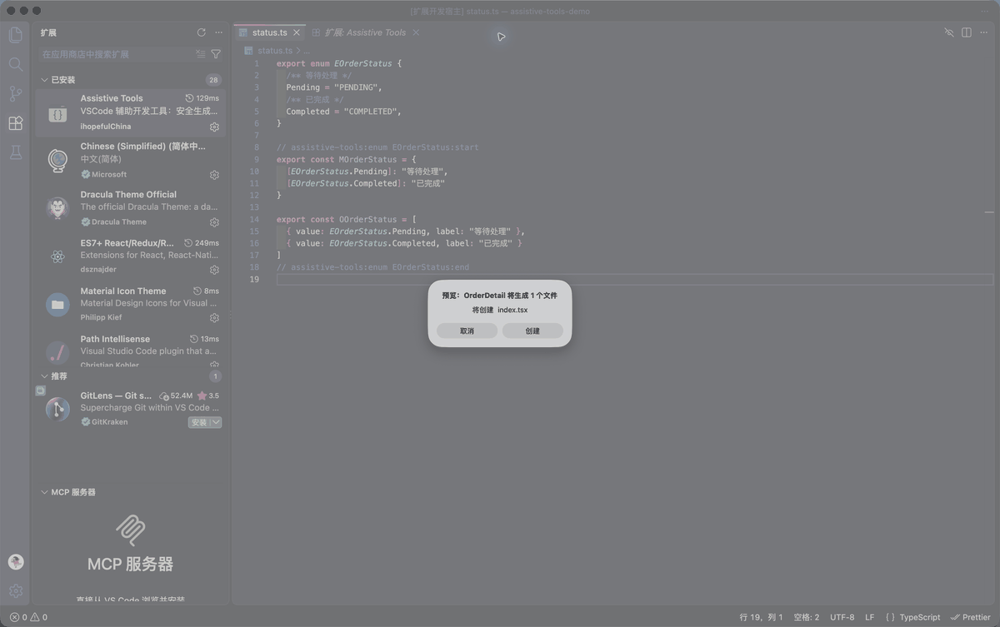
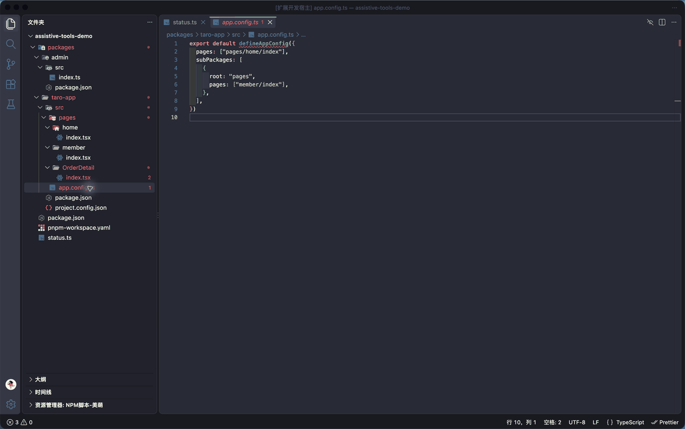

# Assistive Tools

把前端项目里重复、易错、又不得不做的操作收进 VS Code：维护枚举映射、按模板创建文件、运行 Monorepo 脚本，以及同步微信小程序页面调试配置。

[](https://marketplace.visualstudio.com/items?itemName=ihopefulChina.vscode-assistive-tools)
[](https://open-vsx.org/extension/ihopefulChina/vscode-assistive-tools)
[](https://code.visualstudio.com/)
[](./LICENSE.txt)

## 先看实际效果

下面的 GIF 均录制自真实的 VS Code 扩展开发宿主。

### 枚举一键生成 Map / Options

将光标放在枚举名上，执行“转换枚举”。再次执行会更新已有生成块，并保留手工修改过的业务标签。



### 从模板创建页面或组件

选择模板、输入名称、预览即将写入的文件，确认后才真正创建。



### 同步微信小程序页面调试配置

从 `app.config.ts` / `pages.config.ts` 提取主包和分包页面，预览后合并到最近的小程序项目根目录。



## 安装

- [Visual Studio Marketplace](https://marketplace.visualstudio.com/items?itemName=ihopefulChina.vscode-assistive-tools)
- [Open VSX Registry](https://open-vsx.org/extension/ihopefulChina/vscode-assistive-tools)
- 本地 VSIX：在命令面板运行 `Extensions: Install from VSIX...`，选择下载的 `.vsix`

要求 VS Code `1.74.0` 或更高版本。

## 0.1.0 能做什么

| 场景 | 能力 | 关键保护 |
| --- | --- | --- |
| TypeScript 枚举 | 生成或更新 Map、Options | 识别同名冲突；更新时保留已有标签 |
| 页面 / 组件创建 | Vue 2、Vue 3、UniApp、Taro 及自定义模板 | 写入前预览；拦截越界路径和符号链接逃逸 |
| 根项目 / Monorepo | 汇总并运行每个 `package.json` 的脚本 | 根目录脚本固定纳入；按项目包管理器运行 |
| 微信小程序 / Taro | 同步页面到 `project.private.config.json` | 保留 `query`、`scene`、`launchMode` 和手工名称 |

## 实例 1：持续维护枚举 Map / Options

输入：

```ts
export enum EOrderStatus {
  /** 等待支付 */
  Pending = "PENDING",
  /** 已完成 */
  Completed = "COMPLETED",
}
```

操作：将光标放在 `EOrderStatus` 上，通过悬停链接、灯泡或命令面板执行“转换枚举”。

输出：

```ts
// assistive-tools:enum EOrderStatus:start
export const MOrderStatus = {
  [EOrderStatus.Pending]: "等待支付",
  [EOrderStatus.Completed]: "已完成",
}

export const OOrderStatus = [
  { value: EOrderStatus.Pending, label: "等待支付" },
  { value: EOrderStatus.Completed, label: "已完成" },
]
// assistive-tools:enum EOrderStatus:end
```

以后给枚举增加成员，再执行一次即可更新。若已把 `"等待支付"` 改成更贴近业务的文案，插件会保留该标签；如果文件里已有无法确认来源的 `MOrderStatus` 或 `OOrderStatus`，插件会报告冲突，不会静默覆盖。

可选设置：

```json
{
  "assistiveTools.enum.output": "both",
  "assistiveTools.enum.useSatisfies": true
}
```

- `output`: `both`、`map` 或 `options`
- `useSatisfies`: 为 Map 增加 `satisfies Record<Enum, string>` 类型校验

## 实例 2：创建一个 Taro 页面

1. 在资源管理器中右键目标目录，选择“创建页面”。
2. 选择自动推荐的 Taro 模板。
3. 输入 `OrderDetail`。
4. 在预览中确认将创建的文件，然后点击“创建”。

结果：

```text
src/pages/
└── OrderDetail/
    └── index.tsx
```

插件会根据工作区依赖和项目文件自动推荐 Vue 2、Vue 3、UniApp 或 Taro。普通 Vite 项目不会仅因为存在 `vite.config.ts` 就被误判为 Vue。

### 自定义多文件模板

在工作区创建 `.templates/order-detail-page.yml`：

```yaml
name: 订单详情页
description: 页面、样式和类型一次生成
tags: [taro, typescript]
type: page
tpl:
  index.tsx: |
    export default function ${pascalName}() {
      return <View className="${kebabName}" />
    }
  index.less: |
    .${kebabName} {
      min-height: 100vh;
    }
  types.ts: |
    export interface ${pascalName}Params {
      id: string
    }
```

支持 `${name}`、`${pascalName}`、`${camelName}`、`${kebabName}`、`${type}`、`${date}`、`${time}`，也兼容 `[:=PascalName:]` 一类变量写法。

命令面板还提供：

- `模板：导出内置模板`：把选定框架的内置模板导出到 `.templates`
- `模板：校验工作区模板`：检查 YAML、输出内容、重复路径和越界路径

## 实例 3：在一个面板运行根目录和 Monorepo 脚本

项目结构：

```text
shop-workspace/
├── package.json               # 根目录 scripts
├── pnpm-workspace.yaml
└── packages/
    ├── admin/package.json
    └── mini-app/package.json
```

打开资源管理器底部的 `Assistive Scripts`：

```text
shop-workspace
├── shop-workspace (根目录)    package.json
│   ├── lint
│   └── test
├── @shop/admin                packages/admin
│   ├── dev
│   └── build
└── @shop/mini-app             packages/mini-app
    ├── dev:weapp
    └── build:weapp
```

点击脚本即可运行；运行中可停止。还可以收藏常用脚本、只看收藏，以及从“最近运行”快速重跑。

发现规则：

- 无论是否配置 workspaces，根目录 `package.json` 的脚本都会纳入
- 支持 `package.json#workspaces` 和 `pnpm-workspace.yaml`
- 支持包含与排除模式，并忽略常见生成目录
- 优先读取 `packageManager` 字段，其次根据锁文件识别 npm、pnpm、Yarn 或 Bun
- 脚本在所属 package 目录中运行，不会错误地统一切到仓库根目录

## 实例 4：同步 Taro / 微信小程序调试页面

页面配置：

```ts
export default defineAppConfig({
  pages: ["pages/home/index"],
  subPackages: [
    {
      root: "packages/member",
      pages: ["pages/profile/index"],
    },
  ],
})
```

在 `app.config.ts` 或 `pages.config.ts` 上右键，执行“微信小程序：同步页面调试配置”。确认预览后，插件创建或更新：

```json
{
  "condition": {
    "miniprogram": {
      "list": [
        {
          "name": "💻pages/home/index",
          "pathName": "pages/home/index",
          "query": "",
          "launchMode": "default",
          "scene": null
        }
      ]
    }
  }
}
```

已有页面项不会被粗暴重建：插件保留调试参数 `query`、`scene`、`launchMode`，也保留不以 `💻` 开头的手工名称。在 Monorepo 中，它会优先定位离页面配置最近、包含 `project.config.json` 的小程序 package。

如需保存页面配置时提示同步：

```json
{
  "assistiveTools.wechat.syncOnSave": true
}
```

默认关闭，避免保存文件时产生意外写入。

## 命令一览

| 命令 | 用途 |
| --- | --- |
| `转换枚举` | 生成或更新枚举 Map / Options |
| `创建组件` / `创建页面` | 选择模板并预览生成文件 |
| `模板：导出内置模板` | 将内置模板复制到工作区 |
| `模板：校验工作区模板` | 校验 `.templates` 中的模板 |
| `微信小程序：同步页面调试配置` | 合并页面调试配置 |

脚本运行、停止、收藏、筛选和最近运行入口位于 `Assistive Scripts` 视图。

## 行为边界

- 枚举转换只处理可静态解析的普通枚举；声明文件和 `declare enum` 不会改写
- 模板在确认前不写磁盘；覆盖项会在预览中明确标出
- 模板输出只能位于新页面或组件目录内，不能通过绝对路径、`../` 或符号链接越界
- 页面同步只解析字面量 `pages` / `subPackages.pages`；动态拼接无法可靠解析时会停止并提示
- 页面同步只新增缺失项和更新插件生成的名称，不删除微信开发者工具中已有的其他调试项

## 本地开发

```bash
npm ci
npm test
```

在 VS Code 中按 `F5` 启动扩展开发宿主。更完整的手工验收步骤见 [QUICK_START.md](./QUICK_START.md) 和 [TESTING.md](./TESTING.md)，发布流程见 [PUBLISHING.md](./PUBLISHING.md)。

## 反馈与许可

- 问题反馈：[GitHub Issues](https://github.com/ihopefulChina/vscode-assistiveTools/issues)
- 源码：[GitHub](https://github.com/ihopefulChina/vscode-assistiveTools)
- 许可：[MIT](./LICENSE.txt)
